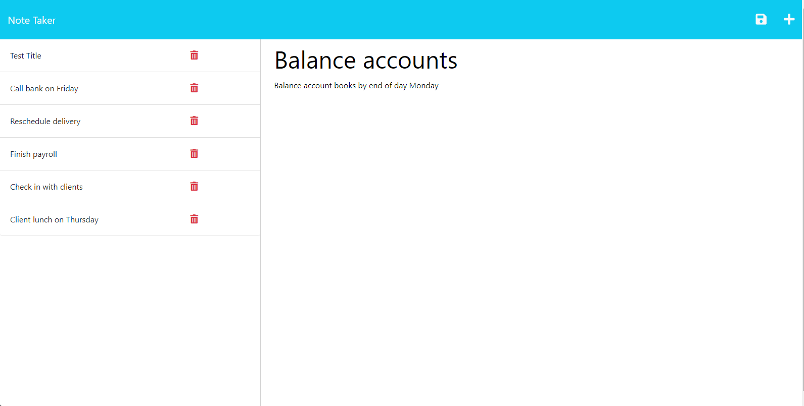

  # ExpressNoteTaker
  
  ## License
  
  
  ## Description
  This is the 11th challenge for the UW Coding bootcamp. This is an HTML application that can be used to create and save notes. Express.js was required to save persistent data in JSON and FS was used to create and read files.
  
  ## Table of Contents
  * [Description](#description)
  * [Usage](#usage)
  * [Questions](#questions)
  
  ## Usage
  You can view the application

  
  
  ## Questions
  Any Questions? Please reachout to me at jkasahara206@gmail.com
  In addition, you can view this project and others at https://github.com/CodeJeffK
